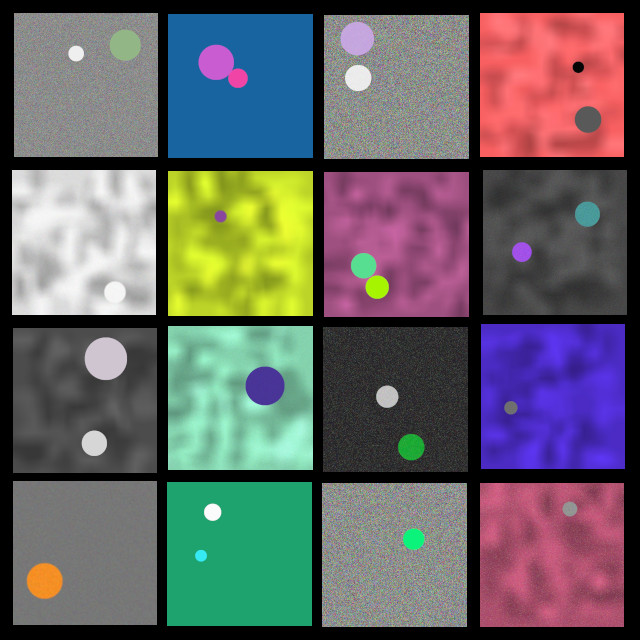

# Project: synthesize-disks

Montage of 16 random disk images, from files generated by `synthdisks.py`. Current coding provides 2 disks per 640 x 640 image. Simple edits can change the number of disks per image, frequencies of various background and fill patterns, and image shape. 

### Overview:
The script `synthdisks.py` is designed to create sets of synthetic randomly augmented images of plain disks to use in YOLO object detection training with custom data. Each image file is saved with a corresponding text file containing the
bounding box and label data in YOLO format (class, x-center, y-center, h, w).
To change the desired image size, edit the img_shape variable in `synthdisks.main()` (just below local imports), as needed.

If running from an IDE, edit the main() function to set the desired number of images
per run and their starting file name index. The current variables are 
num_image_files = 10 and start_idx = 0.

If running from the command line, uncomment in main() function:
<pre>if len(argv) > 1:
    start_idx = manage.arguments()["start_idx"]
    num_image_files = manage.arguments()["num_files"]</pre>
and comment out:
<pre>num_image_files = 10
start_idx = 0</pre>

### Usage:
From within the downloaded repository folder, the recommended command line invocation is : `python3 -m synthdisks` (or `py -m synthdisks` on Windows) for the default vaules of 10 image files starting at index 0. To change the number of image files and/or the starting index, use the command line arguments `--num_files` and `--start_idx` respectively. For example: `python3 -m synthdisks --num_files 400 --start_idx 100` will create 400 image files, automatically names, starting at index number 100. Files are saved to the repository `images` folder.

To view basic information, author, version, license, etc.: `python3 -m synthdisks --about`

To view the help message with command options: `python3 -m synthdisks --help`

Each image will have 1 or two disk shapes. The disk shapes are randomly generated with random colors, sizes, positions, and backgrounds. The number of disks is controlled by the range value of the for-loop in `draw_disks()`. At its current maximum of 2, disks will not overlap. Editing the range beyond 2 will increase the number of disks per image, but disks will likely overlap.

### Requirements:
Python 3.8 or later, plus the packages NumPy, PIL, and skimage. Development environment was Linux Ubuntu 22.04.

As with all repository downloads, it is good practice to install the required packages in a Python virtual environment to avoid undesired changes in your system's Python library.

### Known Issues:
Drawing more than two disks per image will result in overlapping disks in most images. A way to avoid overlap of multiple disks is needed for the filter_disks() function.
